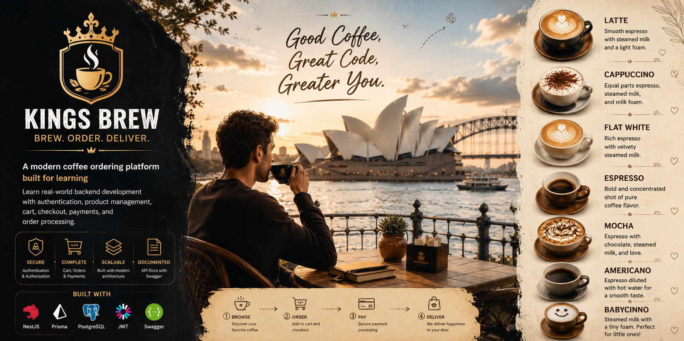

# 👑 Kings Brew

<p align="center">
  
</p>

<p align="center">
  <strong>Brew. Order. Deliver.</strong>
</p>

Kings Brew is a modern coffee ordering platform created as a backend study case project to simulate a real-world coffee commerce ecosystem. The project focuses on implementing scalable backend architecture, authentication, product management, shopping cart workflows, order processing, and payment handling using modern web development technologies.

Inspired by premium coffee culture and the vibrant atmosphere of Sydney, Kings Brew combines elegant branding with practical software engineering concepts, making it an ideal learning project for developers exploring enterprise-level API development.

## ☕ Core Features

- Authentication & Authorization
- Categories Management
- Products Management
- Product Images
- Favorites
- Reviews & Ratings
- Shopping Cart
- Checkout Process
- Orders Management
- Payments Management
- Order Status Tracking
- Audit Logging

## 🏗️ Database Architecture

The system is built around 12 core entities:

- Users
- Categories
- Products
- Product Images
- Favorites
- Cart Items
- Orders
- Order Items
- Payments
- Reviews
- Order Status Histories
- Audit Logs

## 🔄 Customer Journey

```text
Register
   ↓
Login
   ↓
Browse Products
   ↓
Add To Favorites
   ↓
Add To Cart
   ↓
Checkout
   ↓
Create Order
   ↓
Create Payment
   ↓
Order Processing
   ↓
Completed Order
```

## 🚀 Technology Stack

- NestJS
- TypeScript
- Prisma ORM
- PostgreSQL
- JWT Authentication
- Swagger API Documentation

## 🎯 Learning Objectives

Kings Brew is designed to help developers understand:

- Modular NestJS Architecture
- REST API Development
- Database Relationships
- Authentication & Authorization
- E-Commerce Workflows
- Transaction Management
- Backend Best Practices
- Real-World Project Structure

---

<p align="center">
  <strong>👑 Kings Brew</strong><br/>
  Modern Coffee Ordering Platform Study Case
</p>
